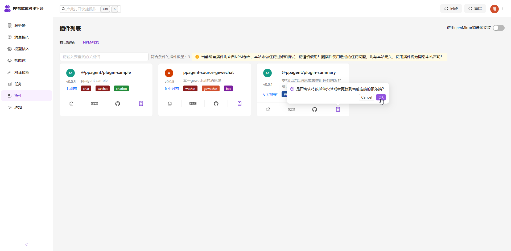
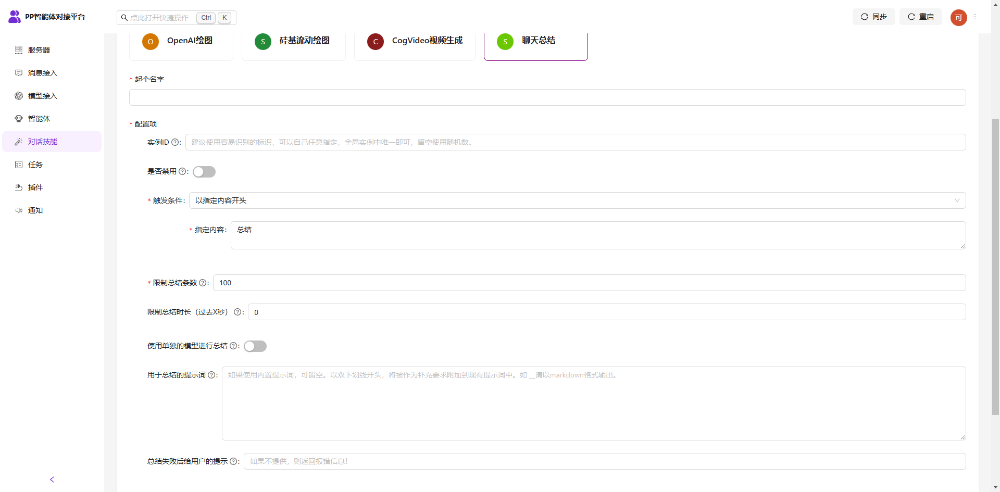
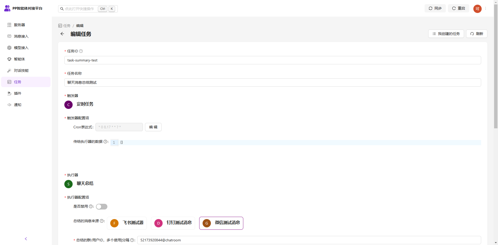
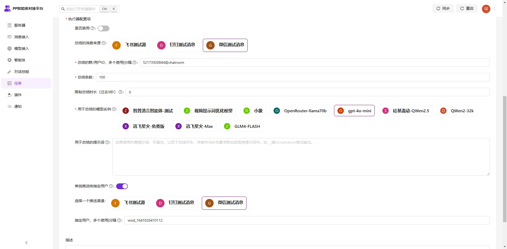

### PPAgent的聊天消息总结插件

#### 安装

##### 1、控制面板中安装

在控制台页面点击`插件`选项，在NPM列表中找到该插件，点击`安装`按钮。



安装完成点击页面右上角`重启`按钮重启服务后，刷新控制台页面，即可在技能或者任务中使用相关功能。

##### 2、二次开发代码中安装

- `pnpm add @ppagent/plugin-summary`
- 在 `app.ts` 中 `import summaryPlugin from "@ppagent/plugin-summary";`
- 在 `app.ts` 中 `chat.use(summaryPlugin);`

> 完整代码可以参考 [app.ts](https://github.com/ppagent/summary/blob/main/src/app.ts)。

### 使用

插件安装后，会注册技能和任务执行器，以下以控制面板中使用为例。（代码中的使用可以参考ppagent官方文档中如何通过代码创建技能和任务的相关内容。）

#### 适合在技能中使用的场景

如果希望用户在对话过程中，通过关键词来触发总结，并接直接将总结结果发送到当前群，则可以创建一个聊天总结的对话技能，然后在智能体中增加这个新的技能引用，并配置好相关的触发词即可。

> 当前框架的智能体本身自带了技能触发词规则，而本插件也支持配置触发词，如果你希望为每一个智能体都支持配置不同的触发词，可以在智能体的技能引用中配置；否则直接在创建技能的时候配置则更为便捷。



#### 适合在任务中使用的场景

如果希望每天定时对某些群进行消息总结，则可以在任务面板中，创建一个新的任务，触发器选择定时器，执行器选择本插件注册的聊天消息执行器即可。






#### 配置项

本插件支持丰富的配置项。

##### 共有配置项

- 总结条数。
- 总结时长。在条数的基础上进行限制。
- 自定义的提示词。支持完全自定义和要求部分自定义。当以双下划线__开头的时候，表示部分自定义，如增加 ```__请使用Markdown格式输出```这类的限定要求。

#### 技能配置项

- 触发条件。支持ppagent内置的内容过滤器，包括开头、In、Contains、Regex四种类型。
- 使用单独的模型进行总结。如果开启，则可以选择单独的模型进行聊天消息总结，否则将使用当前Agent中配置好的模型。
- 总结失败的提示词。不配置会默认输出报错信息。

#### 任务配置项

- 要总结的群类型。选择一个消息来源的渠道。
- 要总结的群ID。支持对所选渠道内的多个群进行同时总结。不同的群号之间用|分割。群号可以发送一条消息后，从控制台查看到。
- 用于总结的大模型。
- 开启单独推送。开启后可以将聊天推送给指定的人或者群，而不是消息所在群。
    - 单独推送到的消息源
    - 单独推送到的人或者群ID。同样发送一条消息即可看到。

